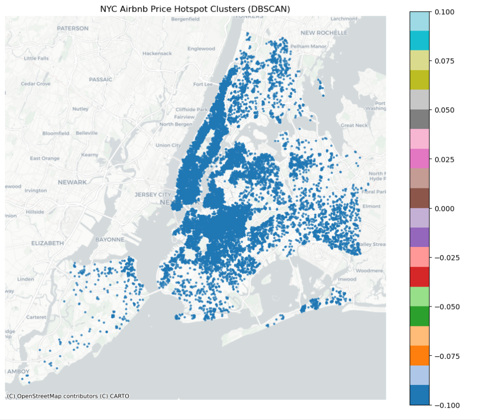
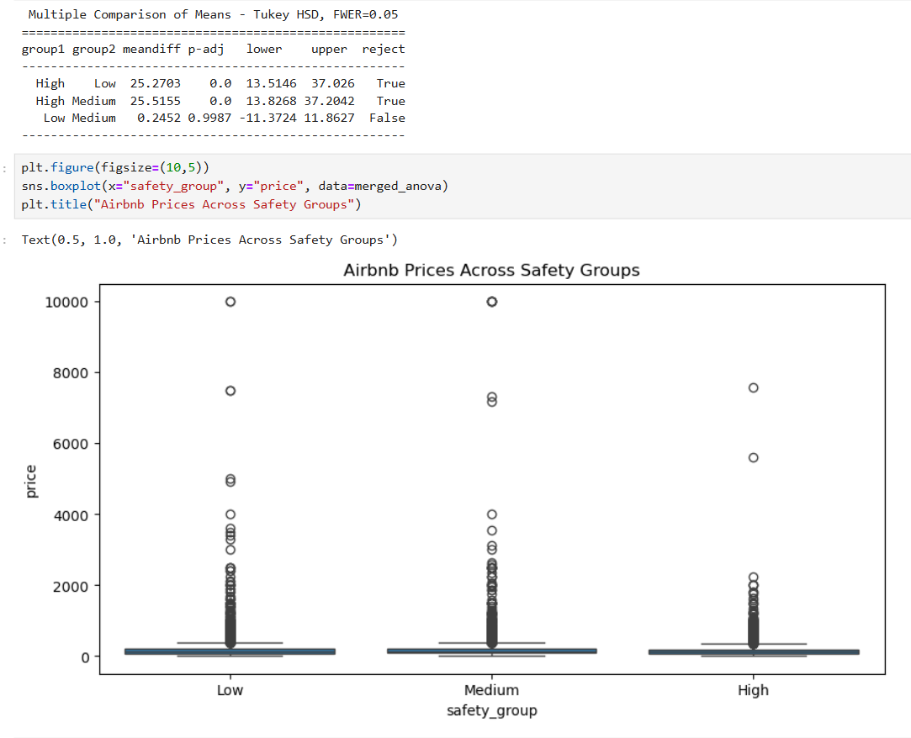

# Machine & Deep Learning

**Keith Faunce**

This repository contains machine learning and data analysis projects using real-world datasets. The work spans classical statistical modeling (simple and multiple linear regression), unsupervised and inferential analysis (ANOVA, clustering), natural language processing (TF-IDF), and deep learning (convolutional neural networks). Each project emphasizes data cleaning, exploratory analysis, model development, evaluation, and visual interpretations

 

## Mortality Data Analysis 1900-2012

The mortality data analysis explores child mortality rates (ages 1–19) in the U.S. from 1900–2012 using an **ETL (Extract, Transform, Load)** framework. By the end of the analysis you can visualize how medical practices have drastically improved over roughly the last century.

_Data files can be found at the top of the notebook_

[Mortality Data Analysis](mortality_pd.ipynb)

### Visualization from the Analysis

| 

 | 

 |
|-----------------------------------------------|-----------------------------------------------|

 

## Relationship between Fish Shape & Weight (Multiple Linear Regression)

This study explores the correlation between fishes weight and their shape (height, width, length), using multiple linear regression to build a predictive model.

[Multiple Linear Regression](fish_multi_lin.ipynb)

[Related Fish Data](fish.csv)

 

## NYC Airbnb Data Driven Insights Analysis

Utilizing three up to date & accurate expansive databases, I conducted analyses such as MLR, Anova Testing, DBScans, and a Panel level DA. These analyses fueled insights as to what affected NYC airbnb prices, and to what degree.

_The datasets for this study can be found on Kaggle, links are provided in the following readme_

[Airbnb Data Analyses](airbnb_kaggle.ipynb)

| 

 | 

 |
|-----------------------------------------------|-----------------------------------------------|

 

## TF-IDF Vectorizer for predicting Used Car Prices

Based on used car descriptions and prices, I leveraged **term frequency** minus **inverse document frequency** to predict used car prices.

_The datasets for this study can be found on Kaggle, a link is provided in the following readme_

[TF-IDF Predicting Used Car Prices](kaggle_kernel_keithfaunce.ipynb)

 

## CIFAR-10 Image Classification using a Convolutional Neural Network

This project hosts a convolutional neural network containing three layers, in addition with flatten/dense (globalpool) and ouput layers which are used to classify images into 10 different classes.

*CIFAR-10 is an image dataset from Tensorflow, more information below*

[Convolutional Neural Network](image_class.ipynb)

 

## Relationship between TV Sales & Advertising

This study explores the relationship between advertising expenditures and sales, using simple linear regression (SLR) to build a predictive model.

[Simple Linear Regression](advertising_pred_slr.ipynb)

[Related Advertising Data](my_company_data.csv)